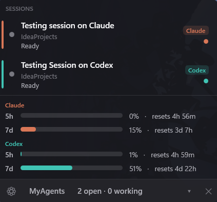
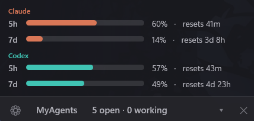
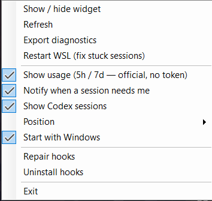

[](https://opensource.org/licenses/MIT)

# MyAgents

 


A lightweight, always-visible app that watches **all your AI-coding terminals at once**.
See what every [Claude Code](https://claude.com/claude-code) and [Codex](https://developers.openai.com/codex)
session is doing (thinking / running a tool / awaiting permission / idle), jump to the exact terminal
with one click, and keep an eye on your 5h / 7d usage — **without reading any token or calling any
undocumented endpoint**.

- **On Windows** it's an always-on-top **corner widget**. Works whether you run the CLIs in **WSL** or
  **native Windows (PowerShell)**. Install with `winget install MiguelAngelRamirez.MyAgents`.
- **On macOS** it's a **menu-bar app** doing the same job — same hooks, same privacy rules, native UI,
  no Dock icon. Install with `brew install --cask miguelangelxramirez/tap/myagents`.

Same product, same privacy contract on both. Jump to [Install](#install).

---


https://github.com/user-attachments/assets/350c4716-db66-4904-97b3-0ead7a5e613e 
 


https://github.com/user-attachments/assets/a53e9fb5-1627-4566-8213-96e9daf57d7e


## What you get

Both platforms give you the same core:

- **One panel for every session.** A live row per Claude Code / Codex session across all your terminals — its **name**, **folder**, and **state** (thinking, running a tool, awaiting permission, idle).
- **Click-to-focus.** Click a row and the exact terminal for that session comes to the front.
  - *Windows:* the precise Windows Terminal **tab**, matched by the session's unique title via UI Automation.
  - *macOS:* the exact tab/window in **Terminal.app / iTerm2 / Ghostty**; the app's window in **Warp / VS Code / Cursor** (per-terminal capability differs).
- **Usage bars, live and token-free.** Your Claude **5h** / **7d** windows and your Codex **5h** / **7d** windows, with reset countdowns (opt-in).
- **A little robot / glyph** whose colour reflects state, and that can show your usage-percent as a badge.
- **Notifications** (toast + sound) the moment a session needs your permission.
- **Self-installing.** It wires up its own Claude hooks + Codex managed hooks — you never run an install script.
  - *Windows:* across native Windows and every running WSL distro.
  - *macOS:* directly in your local `~/.claude` and Codex config.



## Who this is for

Anyone who already has **Claude Code and/or Codex installed and signed in**, runs **several sessions at
once**, and wants a single always-visible place to see what each is doing and jump to it. Usage requires
a **Pro/Max Claude** plan and/or a **Codex** plan (the same accounts the CLIs use).

## Requirements

**Windows**
- Windows 10 or Windows 11
- [Claude Code](https://claude.com/claude-code) and/or [Codex](https://developers.openai.com/codex) installed and authenticated
- **Node.js** available in the environment each CLI runs in (the status hooks are tiny Node scripts)
- WSL is fully supported (the app reads across `\\wsl.localhost`)

**macOS**
- **macOS 26 (Tahoe)** or later, Apple Silicon or Intel
- [Claude Code](https://claude.com/claude-code) and/or [Codex](https://developers.openai.com/codex) installed and authenticated
- **Node.js** on your `PATH` (the status hooks are tiny Node scripts, and the app launches Codex's `app-server` through a login shell to inherit the same `PATH` your terminal has)

## Install

### Windows

```powershell
winget install MiguelAngelRamirez.MyAgents
```

**After installing with winget, run it once:** press **⊞ Win + R**, type `myagents`, and press Enter (or run
`myagents` in any terminal). From then on it lives in your tray, adds itself to the **Start menu** (press
**⊞ Win** and type "MyAgents" to reopen it), and — if you enable **Start with Windows** — launches on boot.

Or download the latest `MyAgents.exe` from the [Releases](https://github.com/miguelangelxramirez/MyAgents/releases) page and run it directly (it's a self-contained single file — no install needed).

### macOS

```bash
brew install --cask miguelangelxramirez/tap/myagents
```

Then launch it once (`open -a MyAgents`, or from Spotlight) — it lives in the **menu bar**, with no Dock icon.
Open its ⚙ menu and choose **Enable tracking** the first time, so it can see your sessions.

Or download `MyAgentsMac-<version>.zip` from the [Releases](https://github.com/miguelangelxramirez/MyAgents/releases) page,
unzip, and drag `MyAgentsMac.app` to `/Applications`. Either way the app is signed with a Developer ID and
**notarized by Apple**, so it opens with a double-click — no Gatekeeper warnings.

Requires **macOS 26** or newer.

## Use

### Windows

Launch it (double-click the exe / the **MyAgents** shortcut, or the `winget`-installed command). It appears
as a **robot icon in the tray** and a **widget in the bottom-right corner**.

> **Reopening it after you close it:** on first launch it adds itself to the **Start menu**, so just press
> **Start** and type **"MyAgents"** to open it again anytime. (Enabling **Start with Windows**, below, means
> you rarely need to.)

- **Click a session row** → focuses that session's terminal tab.
- **Click the tray robot** → shows/hides the widget. (Re-running the exe also brings the widget to the front.)
- **Click the header bar** → collapse / expand the widget (the cursor turns into a hand).
- **⚙ menu** (opens away from the screen edge so it never covers the app): show/hide widget, **show usage**, **track Codex**, **Restart WSL**, export diagnostics, position, **Start with Windows**, repair / uninstall hooks.
- **Position** submenu (or drag-snap) puts the widget in any corner; on a bottom corner it grows upward.

> **▶ [Watch a short demo](docs/screenshots/videoopenandclosingapp.mp4)** — opening and closing the app.

> **Tip:** enable **Start with Windows** from the ⚙ menu so it's always running and you never have to hunt for it.

### macOS

Launch it (Spotlight / Launchpad → "MyAgents", or `open -a MyAgents`). It's a **menu-bar-only app** — no Dock
icon, no window; everything lives behind the glyph in the menu bar.

- **Click the glyph** → opens the popover with a row per live session.
- **Click a session row** → focuses that session's terminal (exact tab where the terminal allows it).
- **⚙ menu** (gear inside the popover): **Enable tracking** (first run — installs the hooks), **Repair
  tracking** / **Remove tracking**, **Show usage** toggle, **Open at login** toggle, **About MyAgents**
  (version + build date), **Quit MyAgents**.

**Permissions it asks for** (both only the first time it actually needs them, never upfront):

- **Automation** — the first time you click a session row, to tell your terminal to bring the right tab/window
  forward. Without it, clicking still activates the app, just not the exact tab.
- **Notifications** — so it can alert you the moment a session is waiting on your approval.

It's **not sandboxed** (by design — reading `~/.claude`, listing processes, and focusing other apps don't fit
the App Store sandbox), but it never asks for Full Disk Access, Accessibility, or Screen Recording.

### Sessions & focus (both platforms)

Each row shows three lines: **name** · **folder** · **state**. Claude's name is the task summary it generates
(`ai-title`); Codex's name is the session's first prompt. A finished-but-unopened session shows a small dot,
cleared when you click it. The left accent bar is the **provider colour** (Claude orange / Codex teal); the
moving glyph (a little robot) shows it's busy.

A session is considered **open while its `claude`/`codex` process is alive** — so the list survives reboots,
sleep/resume and idle, and a closed session disappears on its own.

### Usage (both platforms)

Usage is **opt-in** (off by default; enable **Show usage** in the ⚙ menu). When on:

- **Claude** comes from Claude Code's **official statusline `rate_limits`** — captured by a tiny statusline
  script we register (which also transparently runs any statusline you already had).
- **Codex** comes from Codex's **own local `app-server` RPC** (`account/rateLimits/read`) — the same
  mechanism [CodexBar](https://github.com/steipete/CodexBar) uses.

Both are **live, token-free, and official** — no OAuth token is read and no undocumented endpoint is called in
the public build. If Codex is at its limit (or WSL is momentarily unavailable on Windows), Codex usage falls
back to the value it last wrote to its rollout file. A stale Claude reading (idle session) is greyed and
labelled "N m ago" rather than shown as if it were live.

### Tray / menu-bar icon

A small **robot / glyph**, tinted by state, or your **5h usage %** as a badge when usage is on. On Windows,
left-click the tray robot toggles the widget; if you don't see it, click the tray overflow arrow (▲) and drag
it out to keep it visible. On macOS it sits in the menu bar and opens the popover.



## Updating

**Windows**
- **winget:** `winget upgrade MiguelAngelRamirez.MyAgents` (or `winget upgrade --all`).
- **Portable exe:** download the newer `MyAgents.exe` from Releases and replace the old one.

Updates ship as **GitHub Releases**; winget tracks them, so there's no self-replacing auto-updater (which
antivirus tends to flag).

**macOS**
- **Homebrew:** `brew update && brew upgrade --cask myagents`.
- **Direct `.zip`:** the app updates itself with **Sparkle** (⚙ menu → **Check for Updates…**, plus an
  automatic background check you can opt into on first launch).

See [PUBLISHING.md](PUBLISHING.md) for the full release, winget, and Homebrew flow.

## Diagnostics

- **Windows:** ⚙ menu → **Export diagnostics** writes a `.txt` (sessions, live processes, settings, recent
  perf/focus log — **no tokens**) you can attach to an issue. Or set `CCAPP_DEBUG=1` before launching to log to
  `%TEMP%\myagents.log`. Settings live at `%APPDATA%\MyAgents\settings.json`.
- **macOS:** preferences (show usage, open-at-login) live in
  `~/Library/Preferences/com.miguelangelramirez.myagents.mac.plist`.

## Privacy & security

This project is **open source** — you can audit exactly what it does. **The public build reads no tokens and
calls no network usage endpoints** on either platform. Concretely:

- **Sessions/state:** read from the per-session JSON the hooks write to `~/.claude/statusbar/sessions.d/`, from
  Codex rollout files, and from which `claude`/`codex` processes are alive (via UI Automation on Windows;
  `libproc`/`sysctl` — public APIs only — on macOS).
- **Claude usage:** captured from the data Claude Code itself feeds to your statusline (no token, no network).
- **Codex usage:** read from Codex's own local `app-server` RPC using your already-cached login (no token sent
  over the network, no undocumented HTTP endpoint).
- **Stored locally:** only UI preferences — `%APPDATA%\MyAgents\settings.json` on Windows,
  `UserDefaults` on macOS.
- It does **not** send credentials anywhere, has no backend, and collects no telemetry.
- **Update check (Windows):** at startup, at most **once a day**, a single unauthenticated GET to GitHub's
  public Releases API to see if a newer version exists — no token, no personal data. It never downloads or
  replaces itself; clicking the "update available" link opens the Releases page. Turn it off in
  **⚙ menu → Check for updates**. (macOS uses Sparkle for direct-`.zip` installs instead.)

> A separate **local-only** build flag (`USAGE_LOCAL`) keeps the old undocumented OAuth/`wham` endpoints as a
> fallback — that code is **compiled out of the public release**. See [PUBLISHING.md](PUBLISHING.md).

To remove everything cleanly, see [docs/uninstall.md](docs/uninstall.md) (⚙ menu → **Uninstall / Remove
tracking** does it, including restoring any statusline you had).

## How it works

1. On launch it **self-installs** its status hooks into `~/.claude/settings.json` and Codex **managed** hooks,
   plus a statusline capture script. On Windows that spans native Windows + each running WSL distro (Codex hooks
   under `/etc/codex`); on macOS it's the local filesystem directly.
2. The hooks write one small JSON per session on each event (start, prompt, tool, permission, stop, end).
3. The app polls those files (plus live processes) a few times a second, off the UI thread, and renders the panel.
4. Clicking a row focuses the exact terminal — **UI Automation** by the session's unique title on Windows;
   **AppleScript + Accessibility API** against your terminal on macOS.
5. Usage refreshes about once a minute from the official statusline (Claude) and `app-server` RPC (Codex).

## Footprint (honest)

- **CPU:** negligible on both — all scanning runs on a background thread; the UI never blocks.
- **RAM (Windows):** ~**180 MB** (framework-dependent) to ~**290 MB** (self-contained), flat over time (not a
  leak) — the WPF + .NET cost.
- **RAM (macOS):** a native Swift/SwiftUI menu-bar app; much lighter.

## Build

**Windows (.NET 8 SDK)**

```powershell
# Public (ship this): usage is token-free only
dotnet publish src/MyAgents -c Release -r win-x64 --self-contained true `
  -p:PublishSingleFile=true -p:IncludeNativeLibrariesForSelfExtract=true
# → bin\Release\net8.0-windows\win-x64\publish\MyAgents.exe
```

**macOS (Xcode 26 + [XcodeGen](https://github.com/yonaskolb/XcodeGen))**

```bash
cd mac
xcodegen generate                                       # the .xcodeproj is generated, never hand-edited
xcodebuild -project MyAgentsMac.xcodeproj -scheme MyAgentsMac -configuration Release build \
  -destination 'platform=macOS'
```

See [PUBLISHING.md](PUBLISHING.md) for the framework-dependent build, the `USAGE_LOCAL` flavor, the
winget flow, and the macOS Developer ID + notarization + Homebrew release checklist. The macOS-specific
guide lives in [mac/README.md](mac/README.md).

## Credits & licence

MIT — see [LICENSE](LICENSE). Inspired by, and with attributions in [THIRD-PARTY-NOTICES.md](THIRD-PARTY-NOTICES.md):
[`m1ckc3s/claude-status-bar`](https://github.com/m1ckc3s/claude-status-bar) (the hook mechanism),
[`CodeZeno/Claude-Code-Usage-Monitor`](https://github.com/CodeZeno/Claude-Code-Usage-Monitor) (usage display),
[`onikan27/claude-code-monitor`](https://github.com/onikan27/claude-code-monitor), and
[`steipete/CodexBar`](https://github.com/steipete/CodexBar) (the Codex `app-server` RPC approach).
